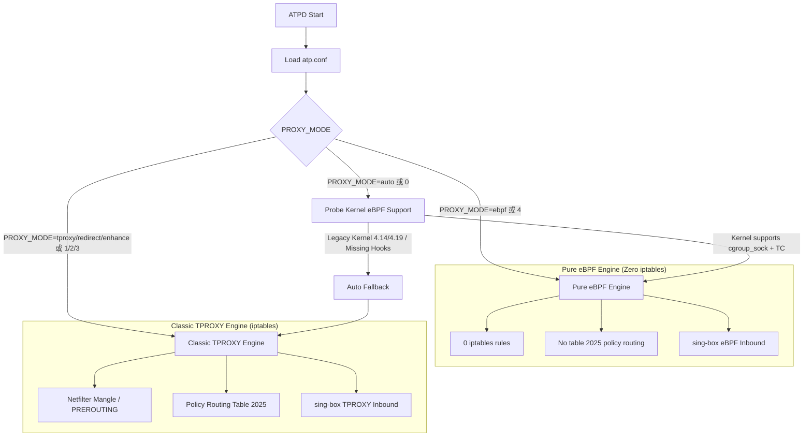

# ATP -- Advanced Transparent Proxy

High-performance transparent proxy daemon for Android powered by a **Dual-Engine Architecture** (Pure eBPF zero-iptables mode & Classic TPROXY/REDIRECT mode), VPN mode switching, FCM connection keepalive, and automatic self-healing.

---

[](https://github.com/atpd-project/atpd/actions)
[](https://www.gnu.org/licenses/gpl-3.0)
[](https://www.android.com/)

---

## Features

| Feature | Description |
|--------|-------------|
| **Dual-Engine Architecture** | Pure eBPF (Zero iptables) and Classic TPROXY (Netfilter) with auto-detection & fallback |
| **Pure eBPF Engine** | Driven natively by sing-box eBPF inbound (`type: "ebpf"`). Zero iptables rules, no Netfilter overhead, lowest latency |
| **Non-invasive Probing** | Diagnostic prober for kernel eBPF maps & program types (`cgroup_sock_addr`, `sched_cls`, `lpm_trie`, `lru_hash`) |
| **IPv4/IPv6** | Independent dual-stack control for both IPv4 and IPv6 |
| **DNS hijacking** | eBPF socket hijacking or TPROXY / REDIRECT interception |
| **China IP bypass** | Native sing-box `bypass_rule_set` (eBPF) or atomic ipset (TPROXY) |
| **Per-app proxy** | UID / package name based routing (native sing-box UID policy or iptables owner match) |
| **MAC filtering** | Per-device proxy control for Wi-Fi hotspots |
| **VPN mode** | Auto-detection and seamless switching for Google VPN (`ipsec`/XFRM) |
| **Self-healing** | Detects and repairs rule drift caused by Android `netd` |
| **Service monitor** | Lifecycle supervisor for `sing-box` with circuit breaker and cooldown |
| **Clash API** | Mode synchronization and real-time traffic statistics via sing-box / Clash REST API |
| **FCM Monitor** | Continuous Google FCM push connection monitoring and rapid reconnection |
| **Performance** | TCP BBR congestion control, conntrack tuning, and CPU governor optimization |

---

## Dual-Engine Architecture

ATPD dynamically supports two mutually-exclusive forwarding engines:



1. **Pure eBPF Engine (`PROXY_MODE=ebpf` / `4`)**:
   - Transparent proxying, UID routing, and China IP bypass are handled directly in the Linux kernel by `sing-box` eBPF inbound hooks (`cgroup/connect4`, `cgroup/connect6`, `cgroup/sendmsg4`, `cgroup/recvmsg4`, TC `sched_cls`).
   - **0 iptables rules**: completely bypasses Netfilter tables, eliminating firewall rule overhead and connection tracking latency.
2. **Classic TPROXY Engine (`PROXY_MODE=tproxy|redirect|enhance` / `1|2|3`)**:
   - Uses `iptables` / `ip6tables` mangle chains, `ipset`, and policy routing (table 2025) to redirect traffic to sing-box TPROXY/REDIRECT listeners.
3. **Auto Adaptive Engine (`PROXY_MODE=auto` / `0`)**:
   - Non-invasively probes the kernel at startup. If eBPF capabilities are present, Pure eBPF Engine is automatically selected; otherwise, it seamlessly falls back to Classic TPROXY without interrupting service.

---

## Requirements

- Android 8.0+ (API 27+)
- Root access (Magisk, KernelSU, or APatch)
- **For Pure eBPF Mode**: Android 12+ GKI kernel (5.10+, 5.15+, 6.1+, 6.6+, 6.12+) with `cgroup_sock_addr` and BPF support
- **For Classic TPROXY Mode**: Kernel with `TPROXY`, `IPSET`, and `CONNTRACK` support

---

## Installation

### Download pre-built binary

Visit [GitHub Releases](https://github.com/atpd-project/atpd/releases) to download the latest `atpd` binary for your architecture.

### Install via adb

```bash
adb push atpd /data/adb/atp/bin/
adb shell chmod 755 /data/adb/atp/bin/atpd
```

### Or build from source

```bash
git clone https://github.com/atpd-project/atpd.git
cd atpd
make
```

---

## Quick Start

```bash
# Create default config (optional)
mkdir -p /data/adb/atp
cp atp.conf.example /data/adb/atp/atp.conf

# Start daemon
/data/adb/atp/bin/atpd start

# Check status & active engine
/data/adb/atp/bin/atpd status

# Probe kernel eBPF support
/data/adb/atp/bin/atpd ebpf probe

# Stop daemon
/data/adb/atp/bin/atpd stop
```

---

## Configuration

ATPD looks for `atp.conf` in `/data/adb/atp/atp.conf` (or the directory containing the `atpd` binary). Use `-c` to specify a custom path.

Example `atp.conf`:

```ini
# Proxy ports
PROXY_TCP_PORT=1536
PROXY_UDP_PORT=1536

# Proxy Mode:
#   auto / 0    = Auto-detect (prefer Pure eBPF, fallback to Classic TPROXY)
#   tproxy / 1  = Force Classic TPROXY (TCP+UDP via iptables)
#   redirect / 2= Force Redirect (TCP only via iptables)
#   enhance / 3 = Force Enhanced TPROXY (TCP=REDIRECT, UDP=TPROXY)
#   ebpf / 4    = Force Pure eBPF (Zero iptables - managed by sing-box)
PROXY_MODE=auto

# eBPF Engine Feature Switch
EBPF_ENABLE=1

# IPv6 support
PROXY_IPV6=0

# DNS hijacking
DNS_HIJACK_ENABLE=1
DNS_PORT=1053

# Routing marks (used in Classic TPROXY mode)
MARK_VALUE=20
TABLE_ID=2025

# Performance Tuning
PERFORMANCE_MODE=1

# API
API_HOST=127.0.0.1
API_PORT=9090
```

---

## Usage

```bash
atpd [options] command
```

### Commands

| Command | Description |
|--------|-------------|
| `start` | Start daemon |
| `stop` | Stop daemon |
| `restart` | Restart daemon |
| `status` | Show runtime status, active engine, and statistics |
| `reload` | Reload configuration without restart |
| `check` | Check configuration syntax and validity |
| `update-geoip` | Update GeoIP database |
| `ebpf probe` | Non-invasively probe kernel eBPF capability for sing-box |
| `ebpf status` | Show eBPF data path and kernel support status |
| `version` | Print version information |

### Options

| Option | Description |
|----------|-------------|
| `-c, --config FILE` | Specify configuration file |
| `-t` | Test configuration and exit (same as `check`) |
| `-f, --foreground` | Run in foreground |
| `-v, --verbose` | Verbose output |
| `-q, --quiet` | Quiet output |
| `--force` | Skip confirmation for dangerous operations |
| `--no-color` | Disable colored output |
| `-h, --help` | Show help |
| `-V, --version` | Show version |

### Examples

```bash
atpd status                       # Show system & engine status
atpd ebpf probe                   # Run eBPF kernel capabilities probe
atpd -c /data/adb/atp/atp.conf start # Start with custom config
atpd -f -v start                  # Start in foreground with verbose log
atpd -t                           # Test configuration
atpd stop --force                 # Stop without confirmation
```

---

## Directory Structure

```
/data/adb/atp/
├── bin/
│   ├── atpd                # Main daemon
│   └── sing-box            # sing-box binary
├── run/
│   ├── atp.log             # ATP log file
│   ├── atpd.pid            # Daemon PID file
│   ├── sing-box.log        # sing-box log
│   └── sing-box.pid        # sing-box PID file
├── rules/
│   ├── cn.zone             # China IPv4 CIDR
│   └── cn_ipv6.zone        # China IPv6 CIDR
├── sing-box/
│   └── config.json         # sing-box configuration (eBPF or TPROXY)
└── atp.conf                # Main configuration
```

---

## Troubleshooting

**Check status & active engine**

```bash
atpd status
ps -A | grep -E "atpd|sing-box"
```

**Probe kernel eBPF support**

```bash
atpd ebpf probe
```

**View logs**

```bash
cat /data/adb/atp/run/atp.log
tail -f /data/adb/atp/run/atp.log
```

**Inspect iptables rules (only in Classic TPROXY mode)**

```bash
iptables -t mangle -L | grep ATP
ip6tables -t mangle -L | grep ATP
```

*(Note: in Pure eBPF mode, iptables contains 0 ATP rules)*

---

## License

GPL v3

## 🙏 Acknowledgments

ATP is built upon the shoulders of giants. Special thanks to:

- **[AndroidTProxyShell]** by [CHIZI-0618](https://github.com/CHIZI-0618) — The original shell script and eBPF inbound design that inspired this project.
- **[sing-box]** by [SagerNet](https://github.com/SagerNet) — The universal proxy core providing native eBPF inbound and Clash API integration.
- **[atp4pixel]** by [yapixel](https://github.com/yapixel/atp4pixel) — The pure eBPF reference architecture for Android GKI kernels.

---
🚀 **Project:** ATP -- Advanced Transparent Proxy
🛡️ **Engine:** Dual-Engine Architecture (Pure eBPF & Classic TPROXY)
